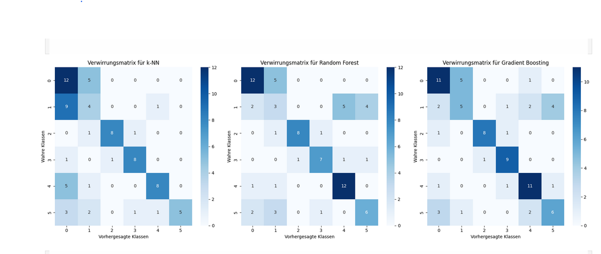
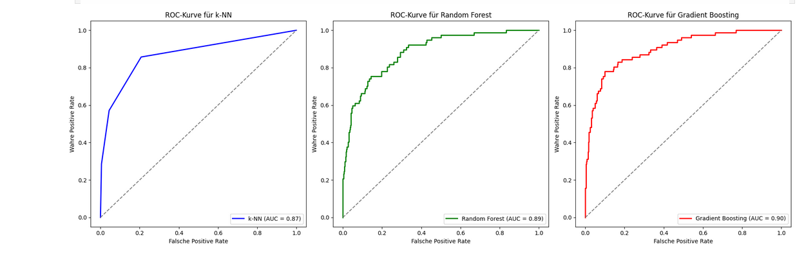

## Verwendete Algorithmen

Random Forest Classifier
Gradient Boosting Classifier
k-Nearest Neighbors (k-NN)

## Datensätze
Gelenkdaten aus einer Nutzerstudie

## Ziel des Projekts
Ziel ist es, verschiedene ML-Modelle miteinander zu vergleichen, um zu bestimmen, welches Modell für diesen Datensatz am besten geeignet ist.

## Modell-Ergebnisse

# Random Forest – Klassifikationsbericht
Accuracy: 0.62
Macro Avg F1-Score: 0.63

# Gradient Boosting – Klassifikationsbericht
Accuracy: 0.65
Macro Avg F1-Score: 0.66

# k-Nearest Neighbors – Klassifikationsbericht
Accuracy: 0.58
Macro Avg F1-Score: 0.62

## Confusion Matrices:

## ROC-Kurve 

## Fazit

Gradient Boosting erzielt die beste Gesamtperformance, insbesondere beim:
Macro-F1
Recall
Accuracy
Random Forest zeigt ebenfalls solide Ergebnisse.
k-NN liefert für einige Klassen gute Werte, ist aber insgesamt weniger stabil.
Bestes Modell: Gradient Boosting Classifier

## Team / Autorin

Laila Almejbel
Informatik (B.Sc.) – Hochschule Worms
Machine Learning & Data Science
